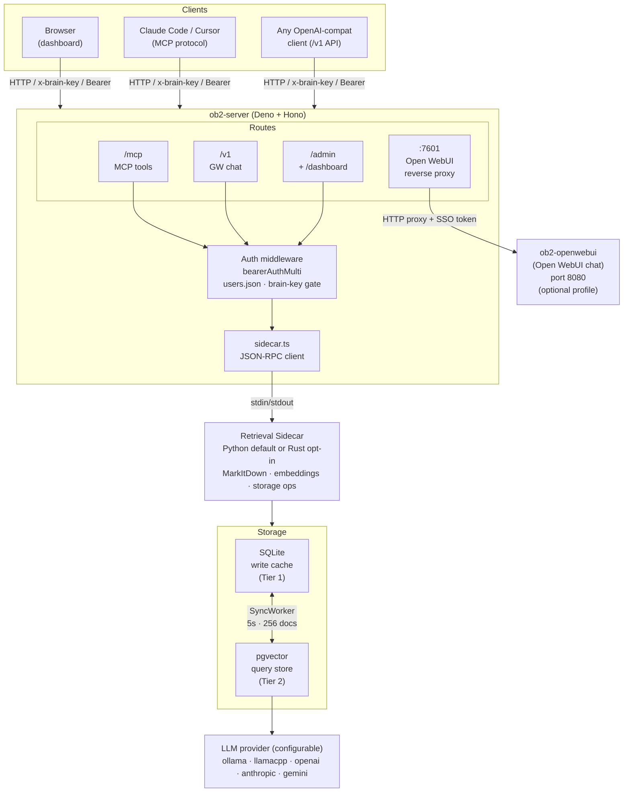
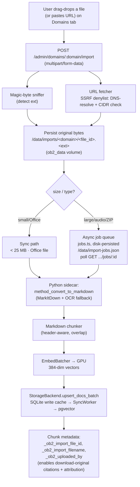
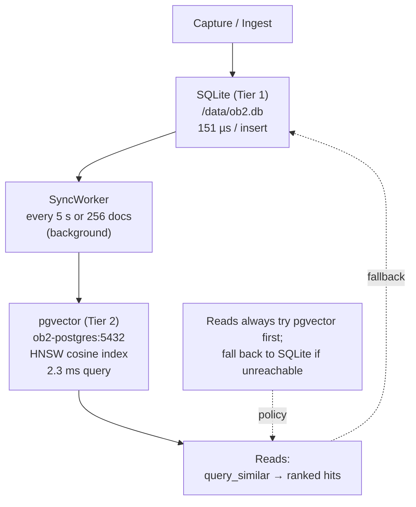
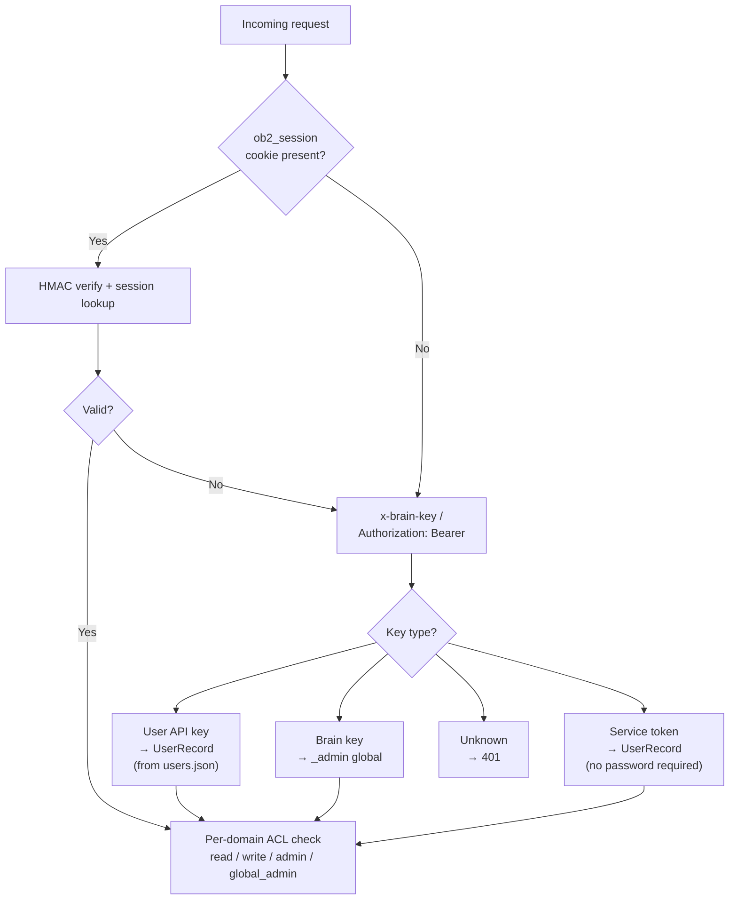
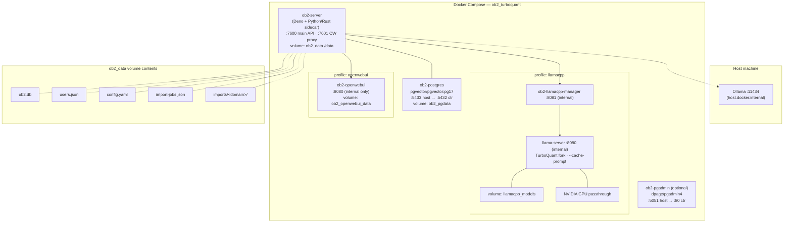

# OB2 Architecture

OB2 is a self-hosted personal RAG platform. Users log in to a web dashboard, upload documents in any format, ask questions of a local LLM, and receive answers grounded in their captured knowledge with clickable source citations. Everything runs on your hardware.

## System Overview



**SyncWorker** runs in the background, syncing every 5 s in 256-doc batches.

## Component Responsibilities

### Server (`server/`)

| File | Responsibility |
|---|---|
| `index.ts` | Entry point. Wires routes, spawns sidecar, inits user store + session store, starts two `Deno.serve` listeners (7600 + 7601). |
| `config.ts` | Parses all `OB2_*` env vars with validation and defaults. Read-only after boot. |
| `runtime_config.ts` | Hot-reloads `config.yaml` on mtime change. Env vars always override file values. Includes `context.show_uploader_in_context` toggle for LLM uploader annotations. |
| `users.ts` | `UserRecord` + per-domain ACL. Cookie-first middleware with Bearer / `x-brain-key` fallback. Brain-key gate. Service-token impersonation for Open WebUI. |
| `auth/passwords.ts` | Argon2id hashing (64 MB, 3 iterations, 1 parallelism). |
| `auth/sessions.ts` | In-memory HMAC-SHA256-signed session store. 12 h TTL, httpOnly, `SameSite=Lax`. Uses `OB2_SESSION_SECRET`. |
| `auth/file_signing.ts` | HMAC-SHA256 tokens for signed file-download URLs (24 h TTL). |
| `auth/openwebui-sso.ts` | 1-minute handoff tokens + 12-hour SSO cookie tokens for the Open WebUI reverse proxy. |
| `auth/reset-tokens.ts` | Single-use password-reset and invite tokens (SHA-256 stored, 1 h / 7 d TTL). |
| `sidecar.ts` | JSON-RPC 2.0 client. Manages subprocess lifecycle, routing to Python or Rust binary. |
| `routes/auth.ts` | `/auth/*` — login, logout, me, change-password, rotate-key, forgot/reset-password, invite, openwebui-handoff. |
| `routes/mcp.ts` | 4 MCP tools: `capture_knowledge`, `search_knowledge`, `knowledge_stats`, `chat_knowledge`, `capture_file`. |
| `routes/gateway.ts` | `/v1/chat/completions` + `/v1/models`. Multi-domain retrieval, @domain prefix routing, service-token impersonation. |
| `llm/provider.ts` + `{ollama,llamacpp,openai,anthropic,gemini}_provider.ts` | Pluggable inference backend. `getProvider()` / `getClassifierProvider()` dispatch on `llm.provider` / `llm.classifier_provider` from runtime config. Cloud providers are chat-only (management methods throw `NotSupported`). See `docs/llm-providers.md`. |
| `llm/sse_parsers.ts` | Shared OpenAI-style SSE → `ChatChunk` parser used by the llamacpp + openai adapters. |
| `routes/admin.ts` | Domain CRUD, alias CRUD, doc deletion, import endpoints, file-download endpoint, user CRUD, sync status. |
| `routes/classifier.ts` | Opt-in query classifier (unused by chat path; in-tree). |
| `routes/config_api.ts` | `GET/PUT /admin/config`, Ollama + pgvector connection testers, aggregated metrics. |
| `proxy/openwebui.ts` | Reverse-proxy listener on port 7601. SSO cookie verification, `X-Forwarded-Email` injection, header-injection strip. |
| `import/runner.ts` | Unified ingest runner: sync path for small/Office files, async dispatch for large/audio/ZIP. |
| `import/jobs.ts` | Async job queue with disk persistence at `/data/import-jobs.json`. |
| `import/sniffer.ts` | Magic-byte detection (PDF, ZIP, DOCX/PPTX/XLSX, PNG, JPEG, TIFF, MP3/WAV/etc). |
| `import/url_fetcher.ts` | HTTP URL fetcher with SSRF denylist (DNS-resolve + CIDR check). |
| `import/chunker.ts` | Header-aware Markdown chunker with configurable overlap. |
| `static/dashboard.html` | Single-page app. Login screen + 8-tab admin UI. |

### Retrieval Sidecar — two wire-compatible runtimes

The Deno server spawns a single retrieval subprocess and speaks newline-delimited JSON-RPC 2.0 over its stdin/stdout. `OB2_SIDECAR_RUNTIME` selects the runtime. Both implement the same methods with byte-identical responses, locked by the golden-fixture suite in `tests/sidecar-golden/`.

#### Python sidecar (`retrieval/`) — default

| File | Responsibility |
|---|---|
| `sidecar.py` | JSON-RPC loop. Loads backend + embedder + batcher on startup. |
| `embed_batcher.py` | Auto-batching: buffers, fires one GPU call per 100 ms or 32 docs. 38x throughput under load. |
| `markitdown_converter.py` | MarkItDown wrapper — file/URL → Markdown. Handles OCR fallback. |
| `storage/backend.py` | `StorageBackend` ABC. |
| `storage/sqlite_vec.py` | SQLite + sqlite-vec. WAL mode. |
| `storage/pg_vector.py` | Postgres + pgvector. HNSW cosine index, connection pooling. |
| `storage/two_tier.py` | `TwoTierBackend` + `SyncWorker`. Writes to SQLite, reads from pgvector, background sync. |

Ingestion formats via `markitdown[all]` + system packages: PDF (text-layer), DOCX, PPTX, XLSX, HTML, Markdown, CSV, JSON, XML, images (PNG/JPEG/TIFF — OCR via Tesseract `tessdata_best`), audio (MP3/WAV/OGG/etc — Whisper), ZIP archives, HTTP URLs, YouTube transcript URLs. Scanned PDFs auto-OCR with `ocrmypdf --rotate-pages --deskew --clean --oversample 300`.

#### Rust sidecar (`sidecar-rs/`) — opt-in via `OB2_SIDECAR_RUNTIME=rust`

| Crate | Responsibility |
|---|---|
| `ob2-sidecar` | Binary: tokio stdin/stdout JSON-RPC loop. |
| `ob2-embedder` | `ort` 2.0 (load-dynamic) + `tokenizers`. Ships ORT 1.24.4 CUDA 13 (has sm_120 PTX for Blackwell). Same `all-MiniLM-L6-v2`, 384-dim. |
| `ob2-storage` | `async_trait` backends: sqlite-vec, pgvector, two-tier + SyncWorker. Schema byte-identical to Python. |
| `ob2-retriever` | Hand-ported TF-IDF + hybrid scorer. |
| `ob2-context` | ContextEngine port — extractive / sentence / truncate strategies, token-budget enforcement. |

Measured on RTX 5090 (Blackwell): cold start 0.36 s (12.9x faster), RSS 687 MB warm (2x smaller), 1,124 caps/sec at 16 concurrent (4x). Default stays `python` pending production soak; both runtimes share the same storage, so switching requires no data migration.

### Ingestion Pipeline



### Two-Tier Storage



Storage mode is set by `OB2_STORAGE_BACKEND`:

| Mode | Write path | Read path | Use case |
|---|---|---|---|
| `two-tier` (default) | SQLite → SyncWorker → pgvector | pgvector (HNSW), SQLite fallback | Production |
| `sqlite` | SQLite only | SQLite brute-force | Dev / single-user |
| `pgvector` | pgvector directly | pgvector (HNSW) | Direct pgvector, no write cache |

### Multi-Domain Retrieval

When a user sends a chat completion with no `@domain` prefix (using model `ob2`), the gateway calls `method_build_multi_context` on the sidecar. This performs a single pgvector scan across all domains the caller has `read` permission on, ranks chunks by cosine similarity together, and returns the top-k across domains. The `@domain` prefix still short-circuits to single-domain retrieval.

The classifier code remains in-tree (`routes/classifier.ts`) but is no longer used on the chat path. Multi-domain retrieval replaced it.

### Auth Architecture



**Service-token impersonation** (for Open WebUI): when the `Authorization: Bearer` value matches `OB2_OPENWEBUI_SERVICE_TOKEN`, the server checks `X-OpenWebUI-User-Name` (set by Open WebUI's `ENABLE_FORWARD_USER_INFO_HEADERS`). If that header names a valid, enabled OB2 user, the request proceeds as that user with their full per-domain ACL. Without the header, the caller gets a `service_only` context (can list models, cannot chat).

### Open WebUI Integration

```mermaid
sequenceDiagram
    participant B as Browser
    participant S as ob2-server :7600
    participant P as Proxy :7601
    participant W as ob2-openwebui :8080

    B->>S: GET /auth/openwebui-handoff<br/>(OB2 session cookie)
    S-->>B: 1-min HMAC handoff token
    B->>P: redirect :7601/?sso=&lt;token&gt;
    P->>P: verify token, issue 12h SSO cookie<br/>strip X-Forwarded-* / X-OB2-*<br/>inject X-Forwarded-Email
    P->>W: GET / (with header)
    W-->>B: Open WebUI loaded (BYPASS_MODEL_ACCESS_CONTROL=true)
    B->>W: user chats
    W->>S: POST /v1/chat/completions<br/>Authorization: Bearer SERVICE_TOKEN<br/>X-OpenWebUI-User-Name: alice
    S->>S: impersonate user · multi-domain<br/>retrieval · augment · LLM
    S-->>W: response with signed citation URLs (24h TTL)
    W-->>B: render message with clickable source links
```

## Containers and Ports



## Dashboard Tabs

| Tab | Who sees it | Contents |
|---|---|---|
| Overview | everyone | Health, domain count, doc count, pending sync, lifetime embeddings |
| Domains | everyone (per-domain read) | Domain list, doc browser (with uploader attribution), drag-drop upload, URL ingestion, aliases, descriptions, per-domain settings |
| Users | global admins | Create/edit/revoke users, set passwords, invite flow, raw-JSON editor |
| Services | global admins | Ollama + pgvector connection testers |
| Config | global admins | YAML editor for `config.yaml` (hot-reload) + env-var readout |
| Processes | global admins | Embedder batcher, sync worker, sidecar stats |
| Chat | everyone (when Open WebUI enabled) | Link to Open WebUI on :7601 |
| Graph | everyone (per-domain read) | Interactive entity/relationship graph preview; "Open full-screen ↗" opens `/graph` full-screen Cytoscape.js explorer (per-type filters, live search, node-click side panel, Run Layout); "Export GEXF ↓" downloads Gephi-compatible graph file via `GET /admin/domains/:domain/graph/export.gexf` |
| Profile | everyone | Change own password, rotate API key, view domain access |

Non-admin users see Overview, Domains, Chat, and Profile only. Domain views are scoped: a non-admin sees only the domains they have a permission on.

## Project Structure

```
OB2/
├── server/              Deno + Hono server
│   ├── index.ts           Entry point, two listeners
│   ├── config.ts          Boot-time env var parsing
│   ├── runtime_config.ts  config.yaml hot-reload
│   ├── users.ts           UserRecord, ACL, auth middleware
│   ├── sidecar.ts         JSON-RPC subprocess client
│   ├── auth/              passwords, sessions, file_signing,
│   │                      openwebui-sso, rate-limit, reset-tokens
│   ├── routes/            auth, mcp, gateway, admin,
│   │                      classifier, config_api
│   ├── proxy/             openwebui.ts (7601 reverse proxy)
│   ├── import/            runner, jobs, sniffer, url_fetcher, chunker
│   ├── mail/              mailer, templates
│   ├── scripts/           reset-admin.ts, openwebui-init.ts
│   └── static/            dashboard.html, dashboard.js, graph.html, graph.js
├── retrieval/           Python sidecar (default runtime)
│   ├── sidecar.py         JSON-RPC methods, startup
│   ├── embed_batcher.py   GPU auto-batching
│   ├── markitdown_converter.py  file/URL → Markdown
│   └── storage/           backend.py, sqlite_vec, pg_vector, two_tier
├── sidecar-rs/          Rust sidecar (opt-in)
│   └── crates/
│       ├── ob2-sidecar/   JSON-RPC binary
│       ├── ob2-embedder/  ORT + tokenizers
│       ├── ob2-storage/   sqlite-vec, pgvector, two-tier
│       ├── ob2-retriever/ TF-IDF + hybrid scorer
│       └── ob2-context/   ContextEngine port
├── cli/                 CLI importers (CSV, docs, PDF, wiki)
├── Dockerfile
├── docker/
│   ├── docker-compose.yml  ob2-server + pgvector + pgAdmin + Open WebUI
│   └── init.sql
├── scripts/             docker-start/stop/restart, start/stop/restart
├── tests/               e2e.sh, mcp_runner.py, sidecar-golden/
└── docs/                This directory
```

## Performance (Rust sidecar vs Python, RTX 5090)

| Metric | Python (torch CUDA) | Rust (ORT 1.24.4 CUDA 13) | Delta |
|---|--:|--:|--:|
| Cold start | 4.63 s | 0.36 s | **12.9x faster** |
| RSS warm | 1,396 MB | 687 MB | **2.0x smaller** |
| Capture avg | 23 ms | 11 ms | 2.1x |
| Retrieve avg | 31 ms | 10 ms | 3.3x |
| Throughput (16 concurrent) | 281 caps/sec | 1,124 caps/sec | **4.0x** |
