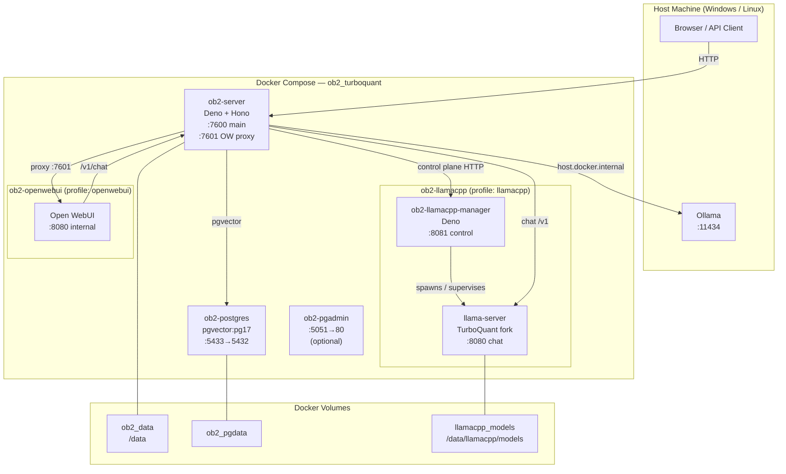
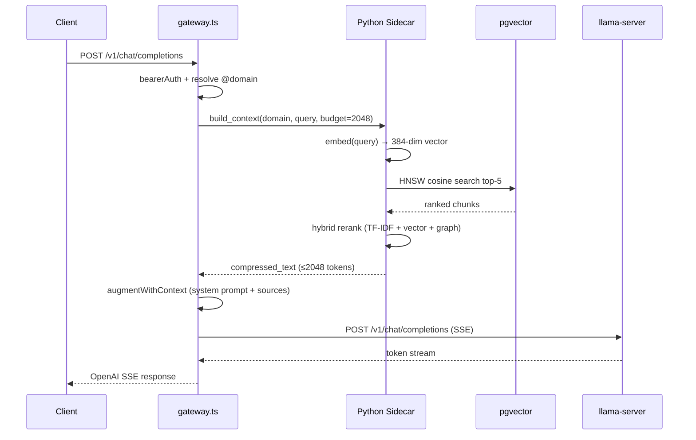
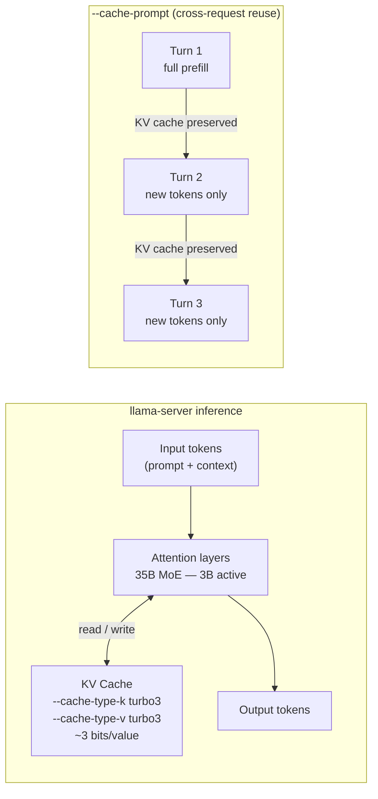
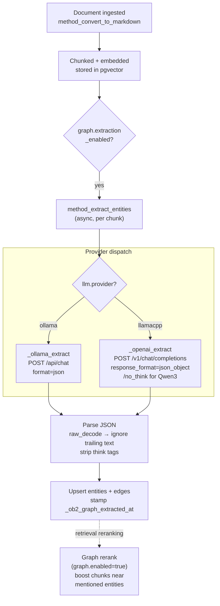
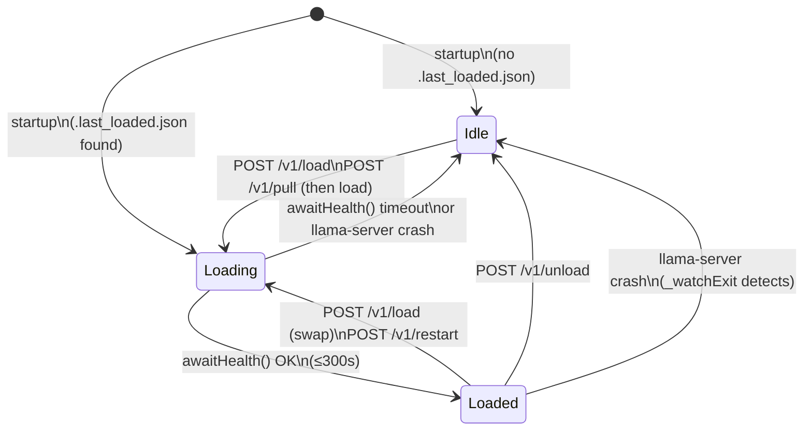
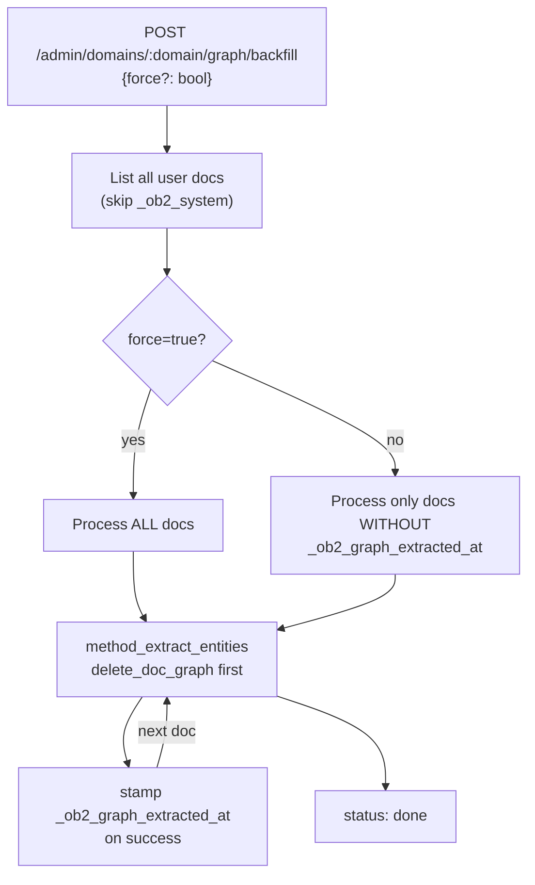
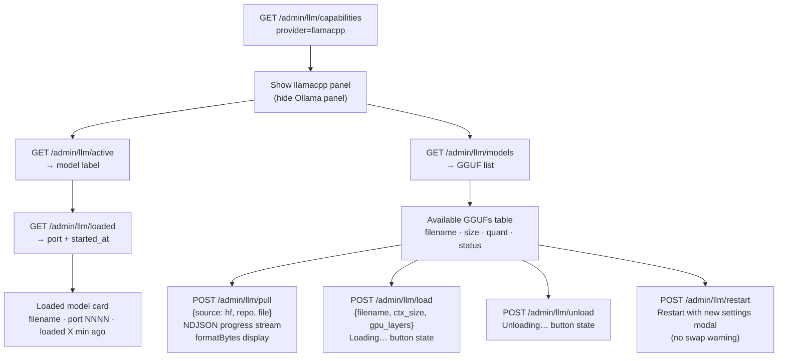
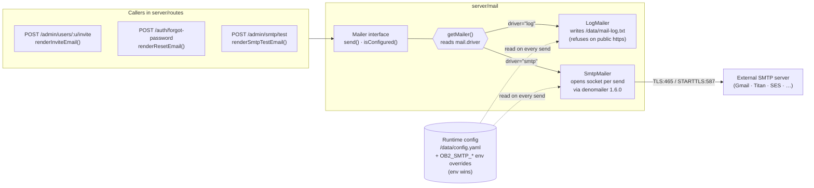
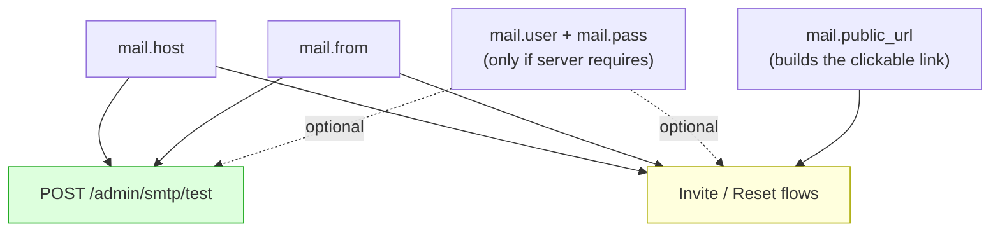
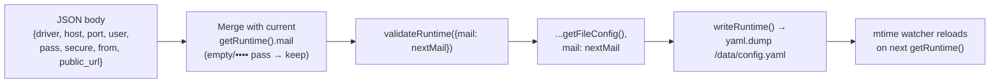

# OB2 TurboQuant — System Diagrams

All diagrams are written in [Mermaid](https://mermaid.js.org/) and render natively on GitHub, GitLab, and in most Markdown previewers.

---

## 1. Container Topology

---

## 2. Chat Request Flow (RAG Pipeline)

---

## 3. TurboQuant KV Cache

---

## 4. Knowledge Graph Extraction Pipeline

---

## 5. llamacpp Manager — Model Lifecycle

---

## 6. Graph Backfill — Resume Logic

---

## 7. Dashboard LLMs Tab — llamacpp Mode

---

## 8. Email / SMTP Subsystem

Three callers, one interface, two drivers, one external SMTP server. Driver selection and credentials are read fresh from `runtime_config` on every send — edits to the dashboard's **Config → Email** card hot-reload without a restart.

**Configuration requirements per caller:**

The test endpoint deliberately does **not** require `public_url` — it only opens a socket and sends one message, no URL building. Older versions checked `public_url` inside `SmtpMailer.isConfigured()` and rejected the test with a misleading `"mailer not configured"`; that check now lives only at the invite/reset call sites where it actually matters.

**`POST /admin/config/mail` write path** (merge, not clobber):

The `getFileConfig()` overlay preserves every other section (`llm`, `llamacpp`, `openai`, `anthropic`, `gemini`, `graph`, `context`, …) that already lives in `/data/config.yaml`, so saving mail credentials never touches LLM provider settings or anything else.

