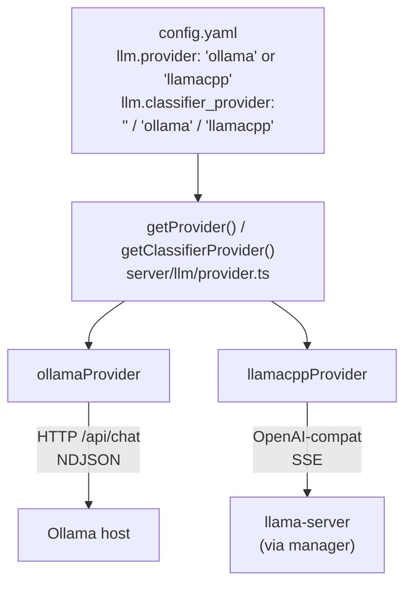
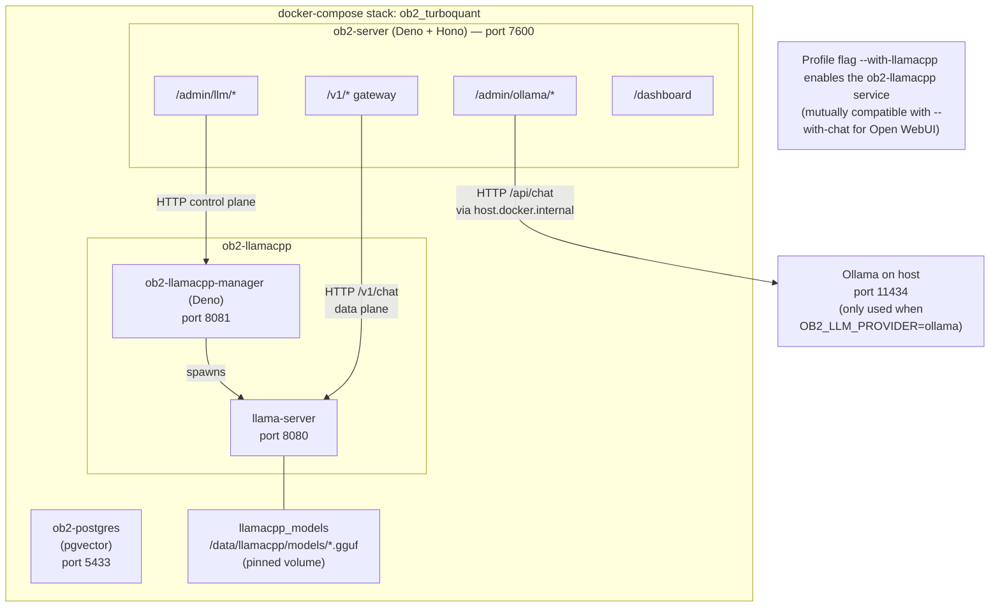
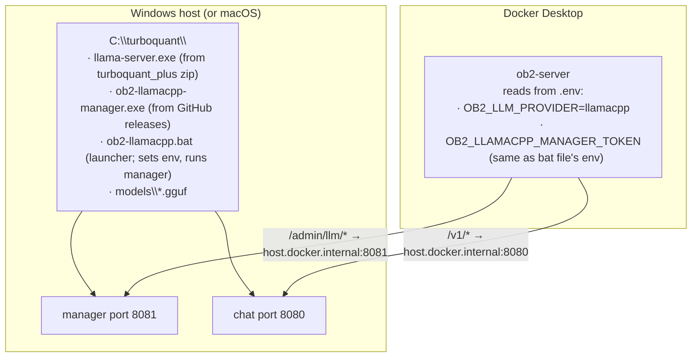
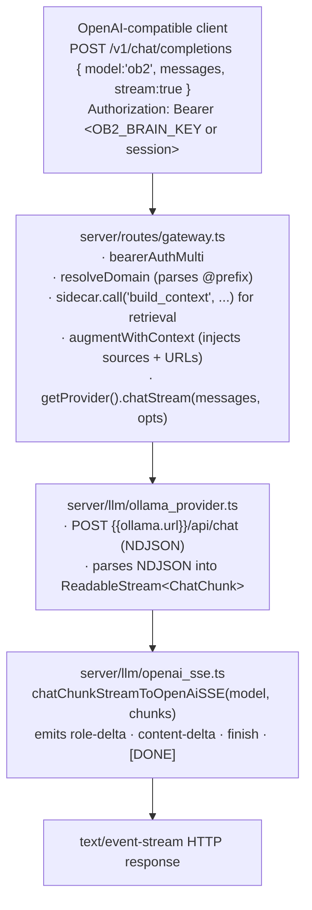
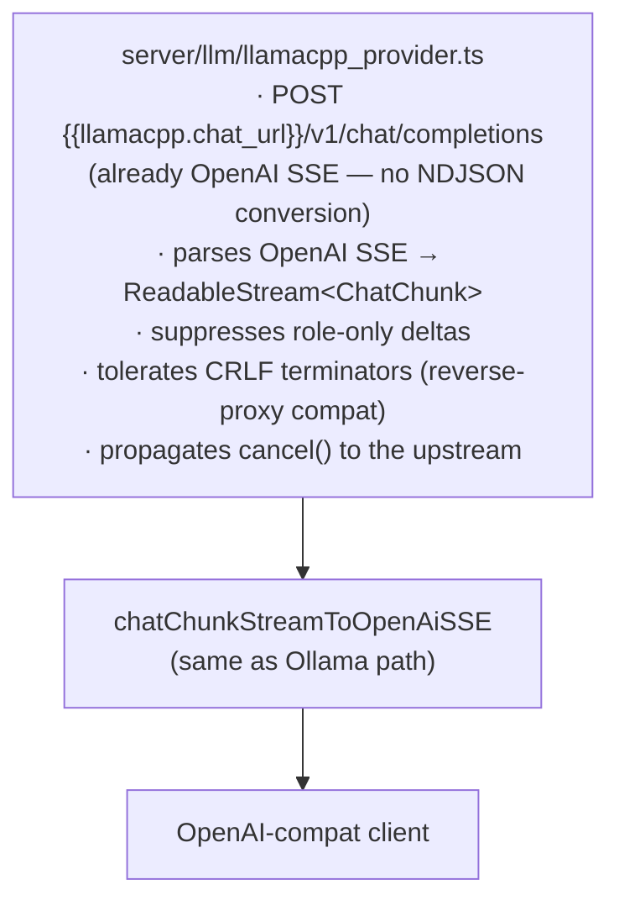
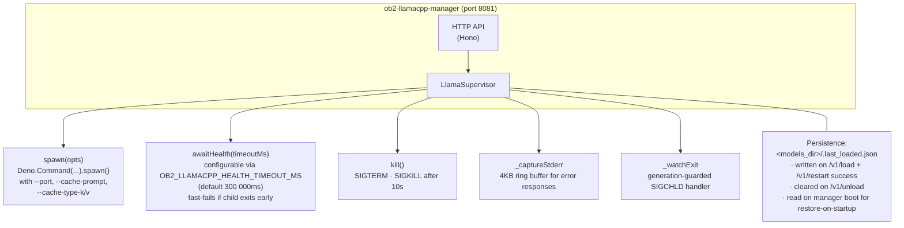
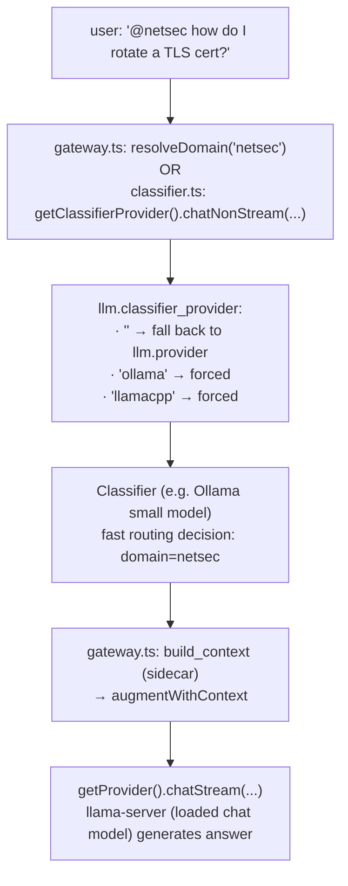

# llama.cpp Provider Architecture

OB2_TurboQuant supports two LLM backends side by side: **Ollama** (the original) and **llama.cpp / turboquant_plus** (added in Phases 1–3). An operator picks the active provider at runtime via `OB2_LLM_PROVIDER` (or the dashboard's Config tab) and the platform routes chat completions accordingly. Both providers can also coexist in cross-provider mode where, for example, fast classification runs on a small Ollama model while chat runs on llama-server.

This document covers:
- The provider abstraction inside the OB2 server
- Two deployment shapes for llama.cpp (containerized + host-mode)
- Request flow for chat completions
- The `ob2-llamacpp-manager` service and its HTTP control plane
- Container topology
- Failure modes and how the dashboard reflects them

If you want to see code, the entry points are:
- `server/llm/provider.ts` — interface
- `server/llm/{ollama,llamacpp}_provider.ts` — adapters
- `llamacpp-manager/main.ts` — manager service
- `server/routes/admin_llm.ts` — provider-aware admin routes

## Provider abstraction (inside ob2-server)

All chat / classification call sites in the server route through one of two factories:



The interface (`server/llm/provider.ts`) defines two surfaces:

- **`ChatProvider`** (always implemented) — `id`, `activeModelLabel()`, `chatStream()`, `chatNonStream()`. The gateway, classifier, and MCP `chat_knowledge` tool all call these.
- **`ManagementProvider`** (partial, gated by `capabilities()`) — `listInstalled`, `listLoaded`, `pullModel`, `loadModel`, `unloadModel`, `warmModel`, `deleteModel`. The dashboard reads `capabilities()` once on page load and greys out unsupported actions.

Capability flags differ by provider:

| Capability | Ollama | llamacpp |
|---|---|---|
| `canList`   | ✓      | ✓        |
| `canPull`   | ✓      | ✓        |
| `canDelete` | ✓      | ✓        |
| `canLoad`   | ✗ (loads on-demand) | ✓ (one model at a time) |
| `canUnload` | ✓      | ✓        |
| `canWarm`   | ✓      | ✗        |

## Deployment shapes for llama.cpp

The same `ob2-llamacpp-manager` Deno binary is used in both shapes; only the packaging differs.

### Shape 1: Containerized (Linux + CUDA)



Boot via `scripts/docker-start.sh --with-llamacpp`. The script auto-generates `OB2_LLAMACPP_MANAGER_TOKEN` (32 bytes hex) into `.env` and sets `OB2_LLM_PROVIDER=llamacpp`.

### Shape 2: Host-mode (Windows / macOS prebuilt binaries)



Boot OB2 normally with `scripts/docker-start.sh` (NO `--with-llamacpp` — that flag is only for the containerized mode). On the host, the operator runs `ob2-llamacpp.bat` (or `.command` on macOS).

See `docs/llamacpp-host-setup.md` for the full walkthrough.

## Chat request flow

End-to-end for a streaming chat completion via the OpenAI-compatible gateway:

### Ollama path (`OB2_LLM_PROVIDER=ollama`)



### llamacpp path (`OB2_LLM_PROVIDER=llamacpp`)

The first three boxes above are identical. The provider differs:



The chat data plane goes **directly** to `llama-server`'s OpenAI-compatible endpoint — the manager is **not** in the request path. Manager unavailability does not break in-flight chats.

## ob2-llamacpp-manager HTTP control plane

The manager owns one `llama-server` process at a time. It speaks an internal HTTP API used by `llamacpp_provider.ts` (and exposed via the dashboard through `/admin/llm/*`):

**Endpoints** — `GET /healthz` is the only unauthenticated route (used by the Docker healthcheck). All `/v1/*` routes require `Authorization: Bearer ${MANAGER_TOKEN}` with a constant-time compare:

| Route | Effect |
|---|---|
| `GET /healthz` | `{ok, version, uptime_sec, llama_server:{...}}` (no auth) |
| `GET /v1/models` | `{models[], loaded}` |
| `POST /v1/load` | kill + spawn · persist `.last_loaded` |
| `POST /v1/unload` | kill · clear `.last_loaded` |
| `POST /v1/restart {ctx_size?, ...}` | re-spawn with overrides |
| `POST /v1/pull {source, ...}` | NDJSON stream · sources: `url` \| `hf` |
| `DELETE /v1/models/:filename` | `409` if loaded |

**Internal architecture:**



The full API spec lives in `docs/superpowers/specs/2026-04-30-llamacpp-provider-design.md` §3.

## Provider switch flow (dashboard)

When an operator flips the provider radio in the Config tab:

```mermaid
flowchart TD
    click["Operator clicks 'llama-server' radio<br/>in Config tab"]
    js["dashboard.js<br/>_putRuntimeConfigPatch({llm:{provider:'llamacpp'}})"]
    put["PUT /admin/config<br/>(read-modify-write)"]
    api["server/routes/config_api.ts<br/>· validateRuntime (rejects unknown values)<br/>· writeRuntime (overwrites config.yaml)"]
    next["next chat request reads getRuntime()"]
    factory["getProvider() returns llamacppProvider<br/>(hot-reload — no restart needed)"]

    click --> js --> put --> api --> next --> factory
```

The status header badge calls `/admin/llm/active` to refresh, and the LLMs tab calls `/admin/llm/capabilities` to switch to llamacpp-mode UI.

## Cross-provider classifier

A documented design decision: chat and classification can run on different providers. Common case — chat on llama-server (one big model loaded), classifier on Ollama (a small fast model like `qwen2.5:0.5b`):



The Config tab's Classifier section shows the **resolved effective configuration** so operators can verify which combination is active without parsing the YAML.

## Failure modes and dashboard surfacing

| What happens | Internal behavior | Dashboard reflects |
|---|---|---|
| Manager unreachable from ob2-server | provider throws `manager_unreachable` | LLMs-tab actions show "Manager unreachable" toast; status badge shows `(manager unreachable)` |
| `llama-server` crashes mid-request | child exit detected by `_watchExit`, `state.running = false` | next chat gets 502; status badge shows `(not loaded)` |
| Bad GGUF / OOM during load | `awaitHealth` fast-fails (≤1s); response includes 4KB stderr tail | Load modal shows `Load failed: <stderr_tail>` |
| Operator deletes a loaded model | manager returns 409 in_use | Dashboard alert: "model is currently loaded — POST /v1/unload first" |
| Provider mismatch with admin endpoint | 503 from `/admin/ollama/*` when llamacpp active | Status header explains the mismatch |
| HF pull of gated repo without token | manager surfaces upstream 401 in NDJSON error frame | Pull dialog status pane shows the error |
| In-flight chat during model swap | hard fail (no auto-retry) | Open WebUI surfaces the error; user retries |

## File layout

```
server/llm/                          provider abstraction
├── provider.ts                      interface, types, factories
├── ollama_provider.ts               wraps server/ollama/{client,pulls}.ts
├── llamacpp_provider.ts             talks to manager + llama-server
└── openai_sse.ts                    shared SSE encoder

server/routes/
├── gateway.ts                       /v1/chat/completions
├── classifier.ts                    auto-routing
├── mcp.ts                           chat_knowledge tool
├── admin.ts                         existing /admin/* + /admin/ollama/* (gated)
└── admin_llm.ts                     /admin/llm/* (provider-aware)

llamacpp-manager/                    standalone Deno service
├── main.ts                          entry point (Hono)
├── auth.ts                          bearer token middleware
├── process.ts                       LlamaSupervisor (spawn/kill/health)
├── state.ts                         .last_loaded.json persistence
└── models.ts                        scan, GGUF parser, pull, delete

docker/
├── Dockerfile.llamacpp              3-stage: llama.cpp + manager + runtime
└── docker-compose.yml               name: ob2_turboquant + llamacpp profile

docs/
├── llamacpp-architecture.md         this file
├── llamacpp-host-setup.md           Windows/Mac walkthrough
├── llamacpp-version-bump.md         LLAMA_CPP_REF runbook
└── upgrade-ob2-to-turboquant.md     stack-rename data migration
```

## TurboQuant KV cache compression

TurboQuant is a 2026 Google DeepMind KV-cache compression algorithm integrated into the TheTom/llama-cpp-turboquant fork. It compresses attention key/value cache entries to ~3 bits per value, enabling:

- **Larger effective context** for the same VRAM budget
- **Faster generation** through reduced memory bandwidth pressure
- **Negligible accuracy loss** vs uncompressed fp16 KV cache

OB2 activates TurboQuant by passing `--cache-type-k turbo3 --cache-type-v turbo3` to llama-server at load time. These are controlled by the `OB2_LLAMACPP_CACHE_TYPE_K` / `OB2_LLAMACPP_CACHE_TYPE_V` env vars (default: `turbo3`). Available levels: `turbo2_0`, `turbo3_0`, `turbo4_0` (higher = more compression, more loss).

**Important:** TurboQuant applies to the KV cache only — not to model weights. Any standard GGUF model (Q4_K_M, Q8_0, etc.) automatically benefits from TurboQuant KV compression when loaded via ob2-llamacpp.

## Prompt caching (KV cache reuse between turns)

llama-server is launched with `--cache-prompt`, which enables cross-request KV cache reuse. When consecutive requests share a common prefix (system prompt + prior conversation history), llama-server reuses the already-computed KV entries. Effect:

- **First message in a conversation:** full prefill over system prompt + user message
- **Subsequent messages:** only the new tokens are prefilled; prefix is served from cache

This is combined with TurboQuant so the cached KV entries are also compressed in VRAM.

## Docker build — static linking

The `Dockerfile.llamacpp` cmake step includes `-DBUILD_SHARED_LIBS=OFF` to statically link all llama.cpp libraries into the `llama-server` binary. This means:

- No runtime `.so` dependencies to copy between build and runtime stages
- Simpler, smaller runtime image
- No `libmtmd.so.0` / `libgomp.so.1` missing-library errors on future builds

The runtime stage still installs `libgomp1 libstdc++6` for any remaining system-level OpenMP / C++ dependencies that can't be statically linked.

## Health timeout

Large models (20+ GB) can take 2–5 minutes to load into GPU VRAM. The manager's `awaitHealth()` timeout is configurable via `OB2_LLAMACPP_HEALTH_TIMEOUT_MS` (default: `300000` ms / 5 minutes). Set this higher if loading very large models on slower storage.

## New admin endpoint: GET /admin/llm/loaded

`GET /admin/llm/loaded` returns the currently loaded model's runtime details:

```json
{
  "loaded": {
    "filename": "Qwen_Qwen3.6-35B-A3B-Q4_K_M.gguf",
    "port": 8080,
    "started_at": "2026-05-01T10:23:45Z"
  }
}
```

Returns `{ "loaded": null }` when no model is loaded. Used by the dashboard to populate the "Loaded model" card with port and load time.

## Graph extraction — provider-aware

The Knowledge Graph entity extractor (`retrieval/sidecar.py`) previously called Ollama's `/api/chat` directly regardless of the configured LLM provider. It now dispatches based on `llm.provider`:

| Provider | Extraction endpoint | Format |
|---|---|---|
| `ollama` | `{OLLAMA_URL}/api/chat` | Ollama NDJSON with `format: "json"` |
| `llamacpp` | `{LLAMACPP_CHAT_URL}/v1/chat/completions` | OpenAI-compatible with `response_format: json_object` |

**Qwen3 thinking mode:** Qwen3 models output chain-of-thought reasoning into a `reasoning_content` field before the actual answer in `content`. The extractor handles this with:
1. `/no_think` in the system prompt to suppress thinking via the chat template
2. A `<think>…</think>` strip regex as a fallback
3. JSON extraction from `reasoning_content` if `content` is empty (triggered by token-limit mid-think)
4. `json.JSONDecoder().raw_decode()` to tolerate trailing text after the JSON object

## Graph backfill — resume and force re-extract

The backfill job (`method_graph_backfill_start`) now supports two modes:

**Normal backfill (default):** skips docs already stamped with `_ob2_graph_extracted_at`. A restarted or interrupted backfill resumes from where it left off — no repeated work.

**Force re-extract:** `POST /admin/domains/:domain/graph/backfill` with body `{ "force": true }` re-extracts all docs regardless of prior extraction stamp. The dashboard exposes this as a **"Force re-extract all"** button with a confirmation prompt.

## RAG pipeline — budget_tokens fix

`server/routes/gateway.ts` previously hardcoded `budget_tokens: 6000` when calling the sidecar, ignoring `retrieval.total_token_budget` from runtime config. This has been fixed to read from `getRuntime().retrieval.total_token_budget` (default: 2048). The hardcoded value caused 3× more context than configured to be sent to the LLM on every chat request, inflating prefill time.

## See also

- **Specs and plans:** `docs/superpowers/specs/2026-04-30-llamacpp-provider-design.md` and `docs/superpowers/plans/2026-04-30-llamacpp-phase{1,2,3}-*.md` — the design that produced this implementation.
- **API reference:** `docs/api-reference.md` — full endpoint listing including `/admin/llm/*`.
- **Deployment:** `docs/deployment.md` — env vars, profiles, scripts.
- **Host setup:** `docs/llamacpp-host-setup.md` — for Windows/Mac operators using the prebuilt turboquant_plus binaries.
