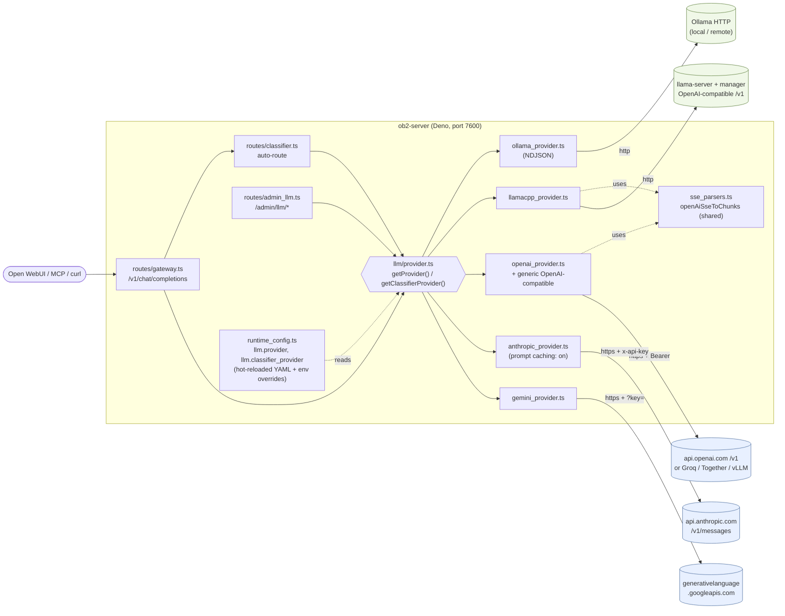

# LLM provider configuration

OB2 talks to LLMs through a `Provider` abstraction. Five backends are wired
in: two local (`ollama`, `llamacpp`) and three cloud APIs (`openai`,
`anthropic`, `gemini`). All five expose the same `/v1/chat/completions` shape
to OB2's gateway — switching backends is a config flip, not a code change.

## Architecture



**How it fits together:**

- The `ChatProvider` interface (`server/llm/provider.ts`) defines a stable
  contract: `chatStream`, `chatNonStream`, `activeModelLabel`. Every provider
  implements it. Management methods (`listInstalled`, `pullModel`,
  `loadModel`, …) are optional — cloud providers throw `NotSupported` and
  the dashboard greys out the corresponding controls via
  `/admin/llm/capabilities`.
- `getProvider()` reads `llm.provider` from runtime config (hot-reloaded YAML
  + env overrides) and dispatches to the right adapter via an exhaustive
  `switch`. Adding a sixth provider is a literal-union extension and one new
  case — TypeScript flags any missed dispatch site.
- `getClassifierProvider()` lets the auto-route classifier run on a
  cheaper/faster model than the chat model. With `llm.classifier_provider:
  ""` (default) it follows the main provider; otherwise it picks any other
  provider id, allowing patterns like "Claude Sonnet for chat, Haiku for
  classification" without leaving the Anthropic API.
- The OpenAI SSE parser is factored out to `sse_parsers.ts` so both the
  llama.cpp adapter and the OpenAI adapter share one tested implementation.
  Anthropic and Gemini have their own parsers (different event shapes, both
  inline in their adapters).
- API keys live in environment variables (`OB2_OPENAI_API_KEY`,
  `OB2_ANTHROPIC_API_KEY`, `OB2_GEMINI_API_KEY`) — never in the YAML, which
  is meant to be committable.

## Selecting a provider

Set `OB2_LLM_PROVIDER` in `.env` (overrides the YAML), or edit
`/data/config.yaml`'s `llm.provider` field:

```yaml
llm:
  provider: anthropic           # ollama | llamacpp | openai | anthropic | gemini
  classifier_provider: ""       # empty = same as `provider`; or pick a different one
```

`classifier_provider` lets the auto-route classifier run on a cheap model
while chat goes through a strong one — common pattern is `provider:
anthropic` + `classifier_provider: ollama` (or just leave it empty and
configure each provider's `classifier_model` instead).

## API keys

API keys live in **environment variables only**, never in the YAML config
(which is meant to be committable). The compose file plumbs these through to
`ob2-server`; set them in `.env`:

| Provider    | Env var                  | Notes |
|-------------|--------------------------|-------|
| `openai`    | `OB2_OPENAI_API_KEY`     | Optional for self-hosted OpenAI-compatible endpoints (vLLM, llama-server) — leave unset and the auth header is omitted. |
| `anthropic` | `OB2_ANTHROPIC_API_KEY`  | Required. Sent as `x-api-key` header. |
| `gemini`    | `OB2_GEMINI_API_KEY`     | Required. Sent as `?key=` query parameter (Google's standard). |

## Per-provider config

Each provider has its own block in `/data/config.yaml`. Defaults shown below;
edit only what you need to change. **Field validation rejects unknown keys**,
so typos surface as a config-reload error rather than silent fallback.

### `openai` — OpenAI and any OpenAI-compatible endpoint

```yaml
openai:
  base_url: "https://api.openai.com/v1"   # override for Groq, Together, OpenRouter, vLLM, bare llama-server
  model: "gpt-4o-mini"
  classifier_model: ""                     # empty → falls back to `model`
```

The most useful knob here is `base_url`. Some examples:

- Groq: `https://api.groq.com/openai/v1`
- Together: `https://api.together.xyz/v1`
- OpenRouter: `https://openrouter.ai/api/v1`
- A self-hosted vLLM box: `http://vllm.internal:8000/v1`
- A bare `llama-server` (without OB2's manager sidecar): `http://10.0.0.5:8080/v1`

Env overrides: `OB2_OPENAI_BASE_URL`, `OB2_OPENAI_MODEL`, `OB2_OPENAI_CLASSIFIER_MODEL`.

### `anthropic` — Claude Messages API

```yaml
anthropic:
  base_url: "https://api.anthropic.com"
  model: "claude-sonnet-4-6"
  classifier_model: "claude-haiku-4-5"     # cheap model for the classifier
  max_tokens: 4096                         # required by Anthropic on every call
  api_version: "2023-06-01"
  prompt_caching: true                     # cache_control on system + leading user turn
```

Prompt caching is on by default and applies a `cache_control: {type:
"ephemeral"}` marker to (a) the system message and (b) the leading user turn.
For the gateway's RAG-context-heavy first turn this typically saves
~80–90 % on the cached portion after the first request. Disable if your
prompts vary at the front (which would just pay the cache-write premium for
no read).

Env overrides: `OB2_ANTHROPIC_BASE_URL`, `OB2_ANTHROPIC_MODEL`,
`OB2_ANTHROPIC_CLASSIFIER_MODEL`, `OB2_ANTHROPIC_MAX_TOKENS`,
`OB2_ANTHROPIC_API_VERSION`, `OB2_ANTHROPIC_PROMPT_CACHING`.

### `gemini` — Google Generative Language API

```yaml
gemini:
  base_url: "https://generativelanguage.googleapis.com"
  model: "gemini-2.0-flash"
  classifier_model: ""
```

Env overrides: `OB2_GEMINI_BASE_URL`, `OB2_GEMINI_MODEL`, `OB2_GEMINI_CLASSIFIER_MODEL`.

## Capabilities

Cloud providers are **chat-only** — `chatStream`/`chatNonStream` work, but
`/admin/llm/{models,pull,load,unload,delete}` returns 501 (`not_supported`).
Model selection is by config, not by dashboard action. The
`/admin/llm/capabilities` endpoint reports which features each provider
supports so the dashboard can grey out unavailable controls.

## Switching providers

```bash
# Edit .env:
echo 'OB2_LLM_PROVIDER=anthropic' >> .env
echo 'OB2_ANTHROPIC_API_KEY=sk-ant-...' >> .env

# Restart ob2-server (config is hot-reloaded but env vars need a restart):
docker compose -f docker/docker-compose.yml restart ob2-server

# Verify:
curl -s -H "Authorization: Bearer $OB2_BRAIN_KEY" \
  http://localhost:7600/admin/llm/active
# → {"provider":"anthropic","model":"claude-sonnet-4-6"}
```

## Choosing a provider

| If you want…                                      | Pick           |
|---------------------------------------------------|----------------|
| Everything on-box, no third-party calls           | `llamacpp` or `ollama` |
| Strongest reasoning, prompt caching for RAG       | `anthropic`    |
| Lowest latency on small prompts (Groq backend)    | `openai` with Groq base_url |
| Cheapest cloud option for high volume             | `gemini` (`gemini-2.0-flash`) or `openai` (`gpt-4o-mini`) |
| Mixed: cheap classifier + strong chat             | `provider: anthropic`, `classifier_provider: ollama` |
