# OB2 Process Flows

All flows are sidecar-runtime-agnostic. The Deno server speaks the same JSON-RPC to both the Python sidecar (default) and the Rust sidecar (`OB2_SIDECAR_RUNTIME=rust`).

## 1. Capture via MCP `capture_knowledge`

```mermaid
sequenceDiagram
    participant C as MCP client<br/>(Claude Code / Cursor)
    participant S as ob2-server
    participant SC as Python sidecar<br/>(EmbedBatcher)
    participant DB1 as SQLite<br/>(Tier 1)
    participant DB2 as pgvector<br/>(Tier 2)

    C->>S: POST /mcp<br/>{tool:"capture_knowledge", domain, text}<br/>x-brain-key: ob2_...
    S->>S: Auth middleware<br/>user API key → UserRecord<br/>or brain key → global admin
    S->>S: check "write" on domain<br/>(403 if denied)
    S->>S: generate doc_id (UUID)
    S->>SC: embed(text)
    SC->>SC: buffer up to 32 docs or 100ms
    SC->>SC: GPU batch encode<br/>all-MiniLM-L6-v2, 384-dim
    SC->>DB1: upsert_doc<br/>(synced_at = NULL · 151 µs)
    SC-->>S: ok
    S-->>C: "Captured to @domain as doc &lt;id&gt;<br/>at &lt;ISO-8601&gt;. Domain has N doc(s)."

    Note over DB1,DB2: Background SyncWorker, every 5s
    DB1->>DB2: batch upsert<br/>(HNSW cosine index)
    DB2-->>DB1: mark_synced
```

## 2. File Ingestion via Dashboard Upload

### Sync path (small files, < 25 MB; Office files)

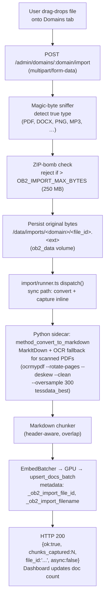

### Async path (large files, audio, ZIP archives)

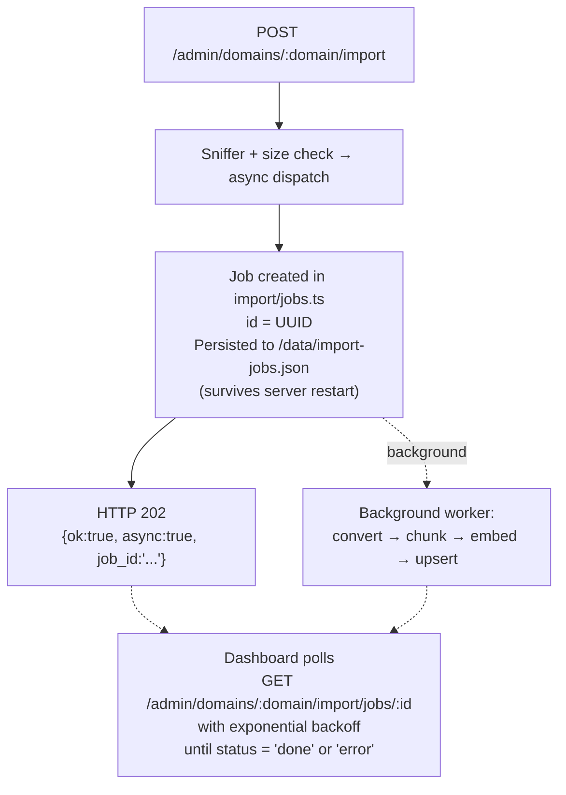

### URL ingestion

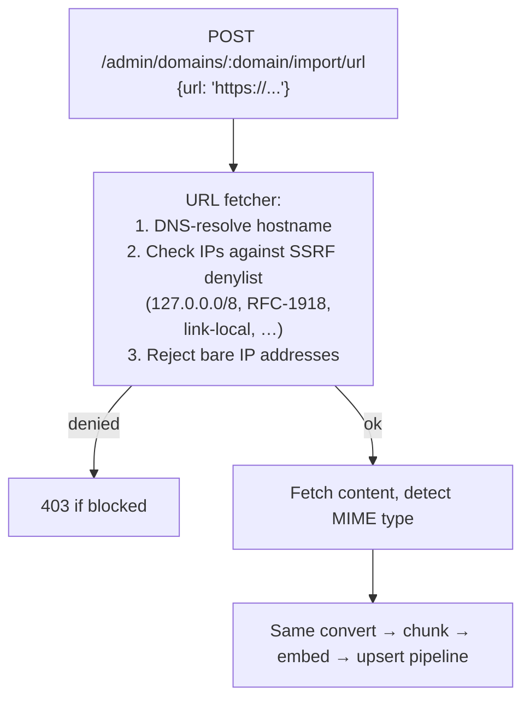

## 3. Chat Flow with Clickable Citation

```mermaid
sequenceDiagram
    participant U as User
    participant W as Open WebUI
    participant S as ob2-server gateway
    participant SC as sidecar
    participant DB as pgvector
    participant L as LLM provider

    U->>W: "how do I check certificate expiry?"<br/>(no @domain prefix · model="ob2")
    W->>S: POST :7600/v1/chat/completions<br/>Authorization: Bearer SERVICE_TOKEN<br/>X-OpenWebUI-User-Name: alice
    S->>S: Auth: service token + username header<br/>→ impersonate alice (per-domain ACL applies)
    S->>S: resolveDomain() — no @prefix → null
    S->>SC: buildMultiContext(domains=alice.readable,<br/>query, budget=2048)
    SC->>DB: single scan across all assigned domains
    DB-->>SC: top chunks ranked by cosine similarity
    SC-->>S: compressed_text (≤2048 tokens)
    S->>S: augmentWithContext()<br/>· system prompt + sources block<br/>· sign 24h HMAC URL per file-backed chunk
    S->>L: POST upstream chat completions<br/>(streaming)
    L-->>S: token stream
    S-->>W: OpenAI SSE with [Source: domain — date]<br/>citations and signed download URLs
    W-->>U: rendered response with clickable source links
    U->>S: click [Source]<br/>GET /admin/domains/:d/imports/:id?t=&lt;HMAC&gt;&exp=&lt;unix&gt;
    S->>S: verify HMAC + expiry
    S-->>U: original file (PDF / DOCX / etc.)
```

## 4. Open WebUI SSO Flow

```mermaid
sequenceDiagram
    participant U as User
    participant B as Browser
    participant S as ob2-server :7600
    participant P as Proxy :7601
    participant W as ob2-openwebui :8080

    Note over U,B: User logged into OB2 dashboard :7600
    U->>B: click "Chat" tab
    B->>S: GET /auth/openwebui-handoff<br/>(OB2 session cookie)
    S->>S: sign 1-min HMAC handoff token<br/>{u:"alice", e:"alice@example.com",<br/>exp: now+60s} · OB2_SESSION_SECRET
    S-->>B: 302 redirect :7601/?sso=&lt;token&gt;
    B->>P: GET :7601/?sso=&lt;token&gt;
    P->>P: 1. Extract sso= param<br/>2. Verify HMAC + expiry (reject replays)<br/>3. Issue 12h SSO cookie (ob2_sso)<br/>4. Strip X-Forwarded-* / X-OB2-* headers<br/>5. Inject X-Forwarded-Email
    P->>W: forward request<br/>X-Forwarded-Email: alice@example.com
    W->>W: WEBUI_AUTH_TRUSTED_EMAIL_HEADER<br/>DEFAULT_USER_ROLE=user<br/>BYPASS_MODEL_ACCESS_CONTROL=true<br/>→ auto-sign-in as alice (or create on first visit)
    W-->>B: Open WebUI loaded<br/>(OB2 model in model selector)
    Note over B,S: Subsequent chats flow through :7600/v1 (see Flow 3)
```

## 5. Bootstrap + Close-Down

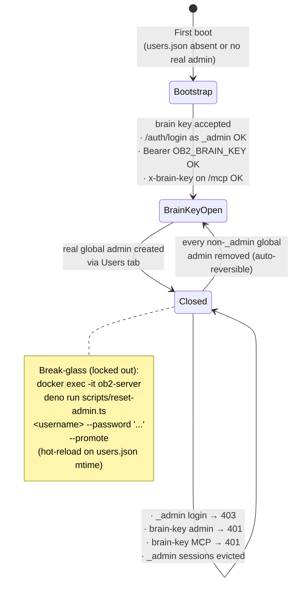

## 6. Two-Tier Sync (SyncWorker)

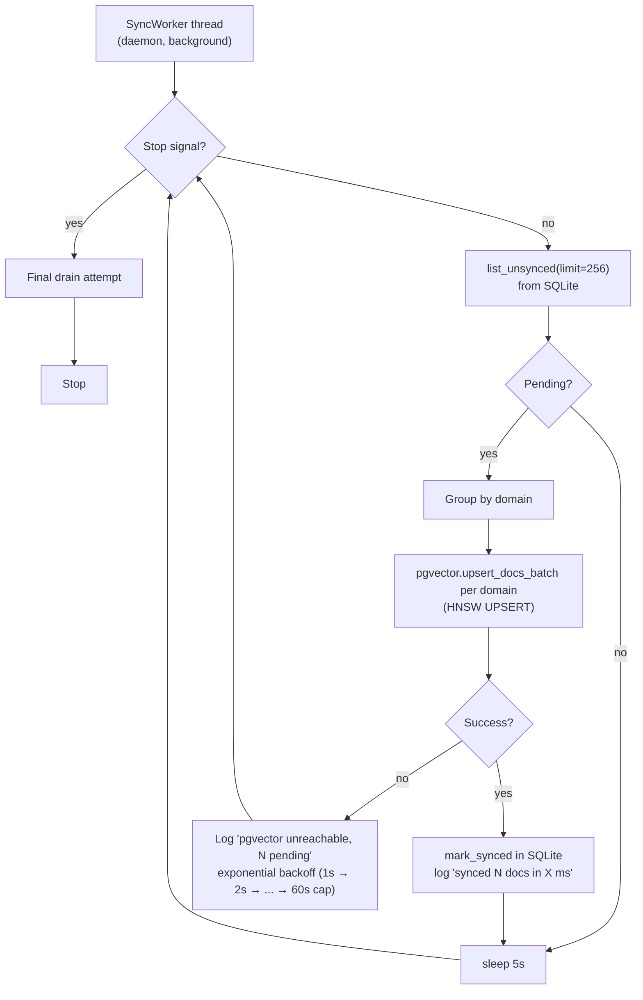

Reads always try pgvector first; fall back to SQLite if unreachable.
`GET /admin/sync-status` returns `pending_docs`, `last_sync_at`, `last_sync_docs`, `last_sync_ms`, `pgvector_reachable`.

## 7. Invite and Password-Reset Flow

**Invite flow:**

```mermaid
sequenceDiagram
    participant A as Admin
    participant S as ob2-server
    participant SMTP as SMTP server
    participant U as New user

    A->>S: Users tab → Create user → "Send invite email"
    S->>S: generate user record (API key, no password)
    S->>S: generate single-use invite token<br/>(32 random bytes; SHA-256 stored)<br/>7-day TTL
    S->>SMTP: email with link
    alt SMTP fails
        S-->>A: invite URL in response body<br/>(manual sharing)
    end
    SMTP-->>U: invitation email
    U->>S: click link → POST /auth/accept-invite<br/>{token, password}
    S->>S: verify token (hash match · not expired · not used)<br/>store argon2id hash
    S-->>U: session cookie · signed in
```

**Password reset flow:**

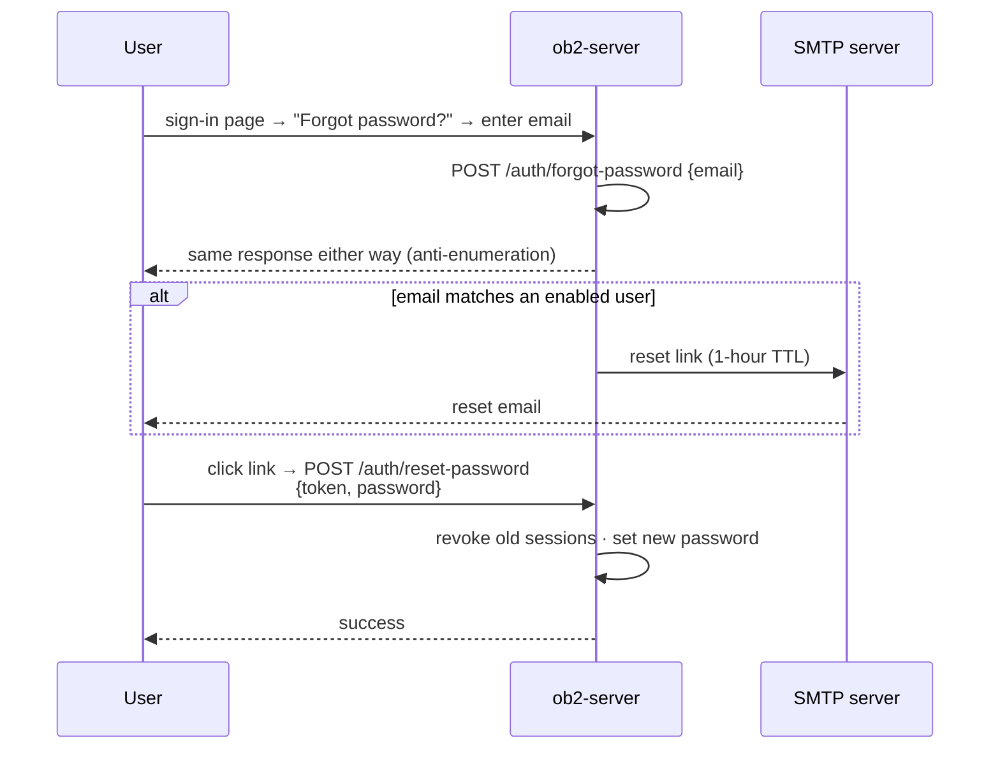

## 8. Domain Backup (Export / Import)

**Export** — admin downloads a domain as a single `.ob2bundle` (gzip tar):

```mermaid
flowchart TD
    click["Dashboard: Manage @domain → Settings → Export"]
    req["GET /admin/domains/:domain/export<br/>(admin perm on the domain)"]
    tmp["admin.ts allocates<br/>/tmp/ob2-export-&lt;uuid&gt;.ob2bundle"]
    rpc["sidecar.call('export_domain', {domain, out_path})"]
    sidecar["Python sidecar:<br/>1. read description from seed doc<br/>2. list_aliases(domain)<br/>3. list_docs(domain, limit=1M) [skip _ob2_system]<br/>4. pack each embedding float32 LE → base64<br/>5. walk /data/imports/&lt;domain&gt;/ for files<br/>6. tarfile.open('w:gz'):<br/>   manifest.json, domain.json,<br/>   documents.jsonl, files/..."]
    stream["admin.ts streams temp file as HTTP body<br/>Content-Disposition: attachment<br/>(temp file unlinked when stream closes)"]

    click --> req --> tmp --> rpc --> sidecar --> stream
```

**Import** — global admin restores a bundle, optionally under a new name:

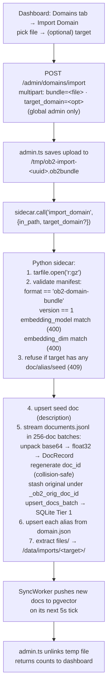

Bundle layout:

```
manifest.json     {format, version, domain, embedding_model, embedding_dim,
                   exported_at, doc_count, alias_count, file_count}
domain.json       {description, aliases: [{alias, canonical}, ...]}
documents.jsonl   one JSON row per document, embedding_b64 = float32 LE
files/<id>.<ext>  original uploaded artefacts, keyed by _ob2_import_file_id
```

System docs (those carrying `_ob2_system: true`) are NOT exported. They are
re-created on import from the description in `domain.json`. File ids and the
metadata link from each doc to its source file are preserved verbatim, so
signed-URL citations and the dashboard's "Download original" links continue
to work after the round-trip.

## 9. Domain Deletion (Cascade Semantics)

Domains are global, not per-user — a domain is one shared store. Deleting
it removes the data for everyone who had access in a single atomic pass.
The dashboard surfaces this only behind a confirmation modal in
**Manage @domain → Settings → Danger zone**.

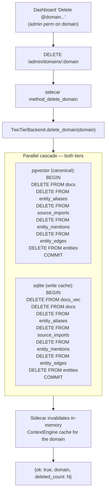

**Side-effects visible to users:**

- Every user who had read on the domain sees zero docs immediately on
  next chat / search / dashboard refresh.
- `@<domain>` chat prefix in Open WebUI returns "no knowledge stored".
- Auto-route classifier no longer considers the deleted domain.

**What the cascade does NOT clean** (deliberate, kept for forensics + re-grant ergonomics):

| Resource | What survives |
|---|---|
| `users.json` user.domains | `["<domain>"]` entries remain pointing at nothing. Re-grant overwrites. |
| `/data/imports/<domain>/` | PDFs / images / audio bytes linger on disk; citation downloads return 404. |
| `webui.db` (Open WebUI) | Per-user chat history messages quoting the deleted domain still show with their original text. |

For a clean, restorable archive *before* deletion, the admin can
**Manage @domain → Settings → Backup → Export @&lt;domain&gt; as .ob2bundle**
(see section 8) — that bundle round-trips the docs, aliases, files, and
graph into a single tarball.

## 10. LLM Management (Switch / Pull / Delete)

The dashboard's **LLMs** tab speaks to Ollama through a thin Deno wrapper
(`server/ollama/client.ts`). All operations target the same Ollama host the
chat gateway uses (`getRuntime().ollama.url`).

**Switch active model:**

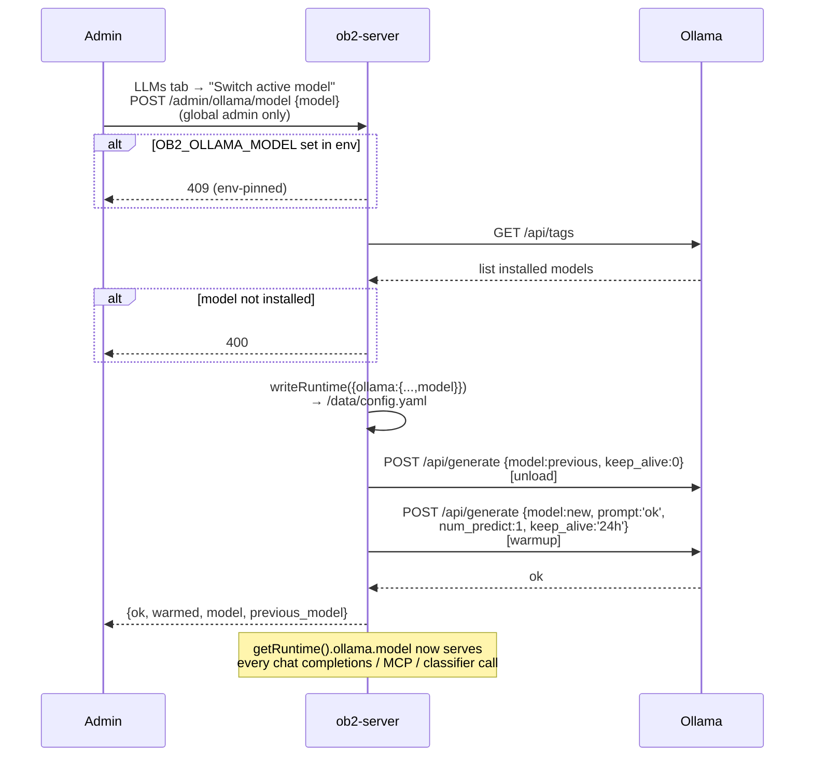

**Pull a model (long-running, async):**

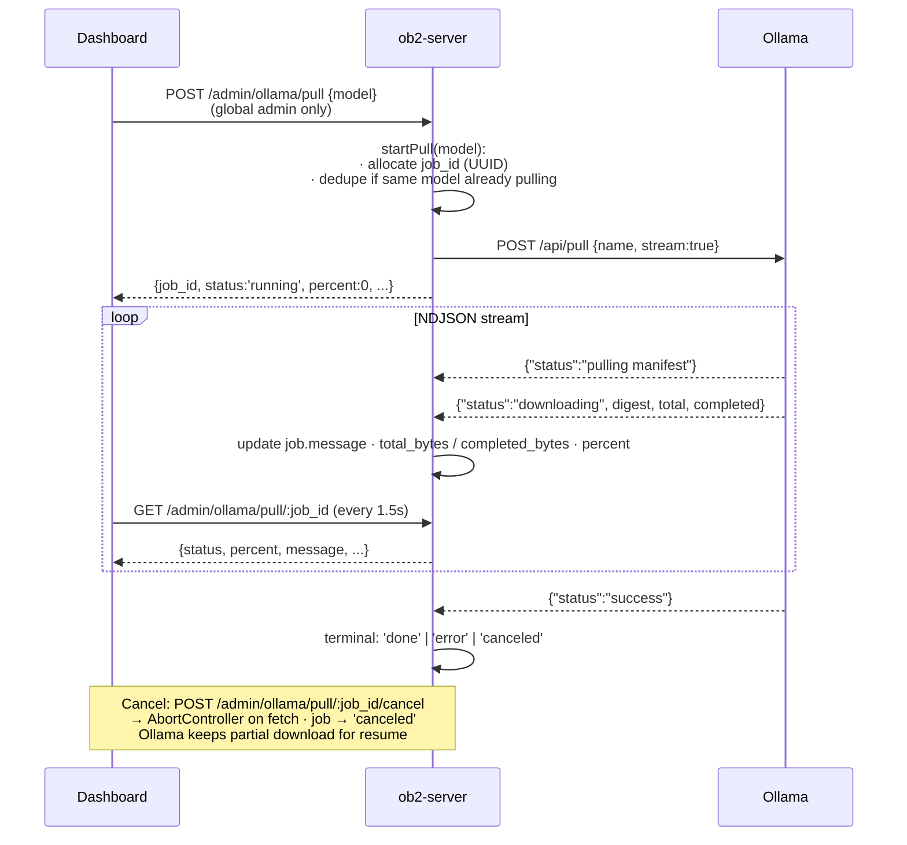

**Delete a model:**

```mermaid
flowchart LR
    click["Dashboard: Installed models →<br/>Delete next to non-active row"]
    req["DELETE /admin/ollama/models/:name<br/>(global admin only)"]
    check{"name == active<br/>getRuntime().ollama.model?"}
    refuse["409 — refuse"]
    unload["POST ollama/api/generate<br/>{model:name, keep_alive:0}<br/>(best-effort unload)"]
    del["DELETE ollama/api/delete {name}"]

    click --> req --> check
    check -->|yes| refuse
    check -->|no| unload --> del
```

**Env-pinned override.** Ollama settings go through OB2's runtime config
layer (`server/runtime_config.ts`). When `OB2_OLLAMA_MODEL` is non-empty in
the container env, it overrides the file value at every read — exactly the
same precedence rule the SMTP fields follow. The dashboard surfaces this
via `env_pinned: true` in `GET /admin/ollama/models`, greys out the
switcher, and shows a banner explaining how to unpin (remove the line from
`.env`, restart). The compose default is empty (`${OB2_OLLAMA_MODEL:-}`)
so users without an `.env` pin can drive everything from the dashboard.

## 11. Knowledge Graph (Extraction / Rerank / Backfill)

OB2 supports lightweight Graph RAG: an async LLM pass extracts named
entities + relationships from each captured doc, and chat retrieval
optionally expands the top vector hits along entity edges. Both are off
by default; toggle via `graph.extraction_enabled` and `graph.enabled`
in `/data/config.yaml`.

**Async extraction during capture:**

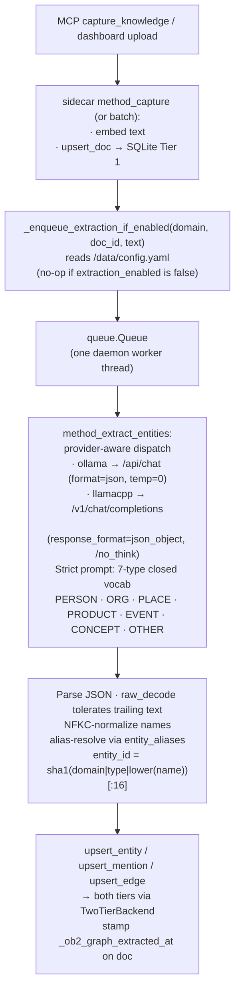

Extraction errors (LLM unreachable, timeout, malformed JSON) are logged and the worker moves on. Vector RAG keeps working; the doc just stays unextracted until the next backfill.

**Graph-augmented retrieval (rerank):**

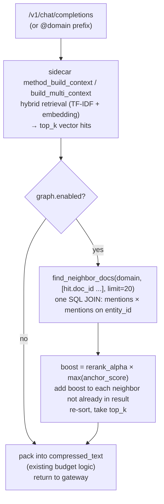

Single SQL roundtrip; ~5–25 ms when enabled, 0 ms when disabled. Multi-domain path groups anchors by source domain so traversal stays inside the caller's readable set (entities are domain-scoped).

**Backfill (re-extract documents in a domain):**

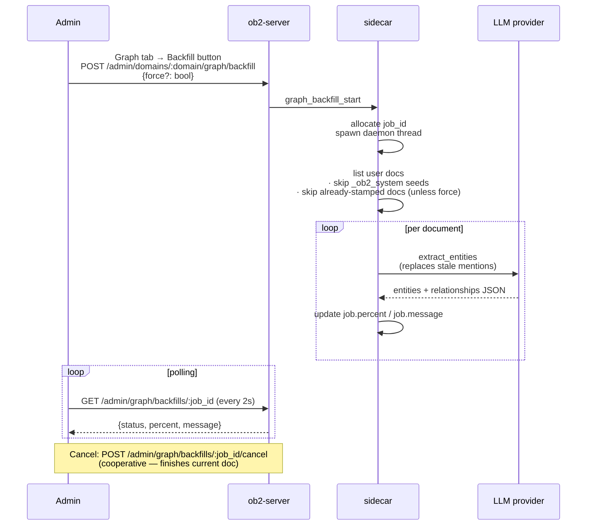

**Bundle export/import:**

`.ob2bundle` carries graph data alongside docs. Manifest gains
`graph_entity_count`, `graph_mention_count`, `graph_edge_count`. Tar
entries: `entities.jsonl`, `mentions.jsonl`, `edges.jsonl`.

On import, entity_ids are re-hashed under the target domain, mentions
are remapped via the doc_id remap built during docs.jsonl restore, edges
are remapped via the entity_id remap. `recompute_mention_counts`
resyncs `entities.mention_count` from the restored mentions. Old
bundles missing graph files are silently accepted - the domain just
imports without a graph (can be backfilled later).

## 12. MCP Test Runner (`tests/mcp_runner.py`)

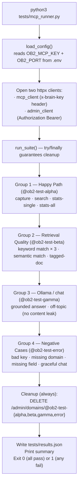

## 13. Upload Provenance

Every captured document carries `_ob2_uploaded_by: "<username>"` in its
metadata. This stamp flows from auth context through all ingestion paths
and surfaces in two places: the dashboard docs table and (optionally)
the LLM context annotations for multi-domain queries.

```mermaid
flowchart TD
    auth["Caller authenticates<br/>(API key / session cookie / service token)"]
    capk["capture_knowledge (MCP)<br/>getAuth().username → metadata._ob2_uploaded_by"]
    capf["capture_file (MCP) or<br/>POST /admin/domains/:d/import (file/URL)<br/>getAuth()?.username / c.get('auth')?.username<br/>→ IngestRequest.uploaded_by<br/>→ captureChunks() stamps all derived chunks"]
    store["StorageBackend: docs.metadata JSON<br/>{ source:'user', _ob2_uploaded_by:'alice', ... }"]
    dash["Dashboard (GET /admin/domains/:domain/docs)<br/>renders as '↑ alice' below each doc's source line"]

    subgraph multi["Multi-domain chat (method_build_multi_context)"]
        on["show_uploader_in_context: true (default)<br/>--<br/>[1] source=@domain<br/>The sky is blue.<br/>  (Saved on 2026-04-26; uploaded by alice.)<br/>--<br/>LLM can answer: 'Who told you that? Alice did.'"]
        off["show_uploader_in_context: false<br/>annotation omitted<br/>(_ob2_uploaded_by still stored in DB)<br/>toggle: Config tab / OB2_CONTEXT_SHOW_UPLOADER"]
    end

    auth --> capk & capf
    capk & capf --> store
    store --> dash
    store --> multi
```

**Single-key mode:** when `users.json` is absent, all captures are attributed
to `_admin`.

**Single-domain queries** (`@domain` prefix): the per-source annotation
format is not used in the single-domain context engine path; uploader
attribution is available in `retrieved_docs` metadata but does not appear
in the compressed text block.

## 14. Full-Screen Graph Explorer

A standalone full-screen page (`/graph`) served by OB2 with a larger Cytoscape.js canvas, per-type filters, live search, and GEXF export. Reached from the dashboard Graph tab via "Open full-screen ↗".

**Opening the explorer:**

```mermaid
flowchart TD
    click["Dashboard Graph tab → 'Open full-screen ↗'"]
    open["Browser opens /graph?domain=&lt;selected&gt;<br/>in a new tab"]
    boot["graph.js boot():<br/>GET /auth/me {credentials:'include'}"]
    auth{"authenticated?"}
    redirect["redirect to /dashboard"]
    init["initPage():<br/>· GET /admin/domains<br/>· populate dropdown (readable only)<br/>· pre-select from ?domain=<br/>· render per-type checkboxes"]
    load["loadGraph(domain):<br/>GET /admin/domains/:domain/graph/entities?limit=500<br/>GET /admin/domains/:domain/graph/edges?limit=2000<br/>(parallel)"]
    filter["applyFilters():<br/>· filter entities by checked types + search<br/>· filter edges whose endpoints survive"]
    render["buildCytoscape(entities, edges):<br/>cytoscape({layout:'cose', numIter:500, ...})"]

    click --> open --> boot --> auth
    auth -->|401| redirect
    auth -->|200| init --> load --> filter --> render
```

**Interactions:**

```mermaid
flowchart LR
    type["Type checkbox toggled<br/>or search text entered"]
    refilter["applyFilters() — re-filter in memory<br/>rebuild Cytoscape (no re-fetch)"]
    rerender["Graph re-renders with filtered set"]

    layout["'Run Layout' clicked"]
    cose["cy.layout({name:'cose', numIter:2000}).run()<br/>(higher iteration count → better node separation)"]

    nclick["Node clicked"]
    docs["GET /admin/domains/:d/graph/entities/:eid/docs?limit=20"]
    side["Side panel: entity name, type, mention count<br/>+ doc snippets mentioning the entity"]

    type --> refilter --> rerender
    layout --> cose
    nclick --> docs --> side
```

**GEXF export:**

```mermaid
flowchart TD
    click["'Export GEXF ↓' clicked<br/>(/graph or dashboard Graph tab)"]
    req["Browser fetches<br/>GET /admin/domains/:domain/graph/export.gexf"]
    sidecar["admin.ts:<br/>list_entities(domain, limit=10000)<br/>list_edges(domain, limit=50000)<br/>(sidecar — parallel)"]
    build["buildGexf(): generate GEXF 1.3 XML<br/>· nodes: entity_id, name, entity_type, mention_count<br/>· edges: src_id, dst_id, relation, weight<br/>· orphaned edges filtered (both endpoints must exist)"]
    save["Content-Disposition: attachment<br/>filename='&lt;domain&gt;-graph-&lt;ts&gt;.gexf'<br/>Browser saves → open in Gephi"]

    click --> req --> sidecar --> build --> save
```
